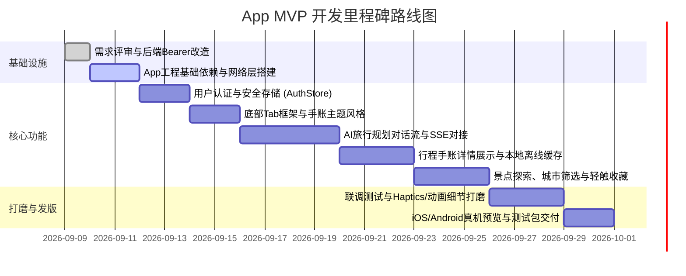

# AI 旅行规划助手 App 端产品需求规格说明书 (PRD)

> **版本**：v1.0.0  
> **编写日期**：2026-09-09  
> **文档状态**：待审查 (Draft for Review)  
> **目标工程**：`ai-travel-planner-app` (Expo 57 / React Native 0.86)  
> **配套服务端**：`ai-travel-planner` (Next.js 16 API Server)

---

## 1. 文档概述与项目背景

### 1.1 项目背景
「AI 旅行规划助手」Web 版已实现基于 Next.js 16、DeepSeek/SiliconFlow LLM、ReAct Agent、RAG 检索增强及 PostgreSQL 的完整全栈业务。为了给差旅出行、在途漫游、碎片化灵感收集等移动场景提供更极致的原生体验，启动配套移动端 App（iOS & Android）的研发。

### 1.2 产品定位与核心价值
- **定位**：具有「手账旅行家温度」的个人专属智能旅行顾问。
- **核心主张**：打破传统 OTA 机械冰冷的列表堆砌，结合自然语言对话流与高审美手账视觉，让旅行规划从繁重的“做攻略”变成赏心悦目的“手账创作”。
- **协同关系**：App 端专注移动端原生交互、手账动效与离线体验；后端完全复用 Web 项目已有的成熟业务服务与 AI 引擎。

---

## 2. 用户画像与核心使用场景

| 角色画像 | 核心痛点 | App 场景解决方案 |
| :--- | :--- | :--- |
| **都市年轻白领 / 周末特种兵** | 没时间做繁杂比价与路线编排，需要 10 秒快速得到靠谱周末游方案 | 首页一键触发灵感卡片，通过 AI 快捷指令秒级生成 1~3 天结构化手账行程。 |
| **自由行手账深度爱好者** | 厌倦千篇一律的攻略模板，重视行程的美学呈现、情绪价值与纪念意义 | 提供手账质感日程卡、盖章徽章收集、明信片打卡，打造沉浸式旅行仪式感。 |
| **旅途中漫游者（在途场景）** | 地铁/航班/山区网络不稳定，频繁掏出手机查看下一个景点路线费电卡顿 | 关键已存行程支持离线本地强缓存，无网状态也能随时翻看每日打卡清单。 |

---

## 3. 总体架构与技术选型

### 3.1 架构拓扑
```text
┌────────────────────────────────────────────────────────┐
│             ai-travel-planner-app (Client)             │
│  Expo SDK 57 + React Native 0.86 + Expo Router v57    │
│  Zustand 5 (Auth & Storage) + expo-secure-store        │
└──────────────┬──────────────────────────▲──────────────┘
               │ HTTP / JSON API          │ SSE Stream (Chat)
               │ (Bearer Token)           │ (Fetch / SSE Parser)
┌──────────────▼──────────────────────────┴──────────────┐
│             ai-travel-planner (Backend)                │
│  Next.js 16 Route Handlers (/api/*) + PostgreSQL       │
│  ReAct Agent + SiliconFlow / DeepSeek + RAG Vector     │
└────────────────────────────────────────────────────────┘
```

### 3.2 技术栈明细
- **跨端框架**：React Native 0.86 + Expo SDK 57
- **路由系统**：`expo-router`（文件式原生栈与 Tab 导航）
- **状态管理**：`zustand` 5（全局用户态、行程收藏缓存、设置）
- **安全与存储**：
  - `expo-secure-store`：存储敏感的 JWT Token、用户私密凭据。
  - `@react-native-async-storage/async-storage`：缓存离线行程手账、城市列表与历史搜索。
- **网络通信**：
  - RESTful：`fetch` / 封装型 HTTP Client（统一拦截器、自动注入 Bearer Token、统一错误处理）。
  - 流式对话：`react-native-sse` 或支持流式读取的 Fetch Polyfill（解析 SSE 格式打字机效果）。
- **原生能力集成**：
  - `expo-location`：获取设备 GPS 坐标，用于自动匹配当前城市与天气。
  - `expo-haptics`：盖章打卡、点赞收藏、Tab 切换时的微触觉振动反馈。
- **视觉与动画**：
  - 原生 `StyleSheet` + `react-native-reanimated` 4 + `react-native-gesture-handler`。

---

## 4. 产品功能需求（阶段规划）

本产品采取**渐进式迭代路线**：
- **阶段一（MVP）**：主攻「基础体验闭环 + 核心 AI 对话规划 + 手账行程详情与离线 + 景点浏览与收藏 + 登录认证」。
- **阶段二（增长与社交）**：引入「社区发帖与图文互动 + 系统日历同步 + 明信片海报导出分享」。

### 4.1 底部导航结构 (Main Tabs)
App 主界面采用 4 个标准原生底部 Tab（阶段二扩展为 5 个）：

```text
├── (tabs)
│   ├── index       # [首页] 灵感发现、当前城市、热门目的地
│   ├── chat        # [AI 规划] 核心规划对话、灵感提示词、流式输出
│   ├── explore     # [发现] 景点探索、城市筛选、收藏打卡
│   └── profile     # [我的] 个人中心、离线行程库、收藏清单、设置
```

---

### 4.2 模块详细需求说明（MVP 阶段）

#### 4.2.1 首页 (Home / Inspiration)
- **定位**：旅行灵感的触发地与快捷入口。
- **主要内容与交互**：
  1. **顶部城市定位与天气挂件**：
     - 调用 `expo-location` 申请粗略地理位置，匹配最近城市。
     - 若未授权则默认展示“北京”或上次选择的城市。
     - 调用 `/api/weather?city={cityName}` 实时显示气温、天气图标与穿衣旅行建议。
  2. **灵感盲盒 / 快捷提问胶囊**：
     - 横向滚动推荐词胶囊（如：“杭州 3 日慢节奏游”、“成都周末美食特种兵”、“千元内海岛小众游”）。
     - 点击胶囊直接带入提示词跳转至【AI 规划】Tab 并自动发起提问。
  3. **精选目的地 / 灵感卡片流**：
     - 手账风格卡片展示热门目的地精选（含封面图、手写感标签、推荐游玩天数、预算评级）。
     - 点击直达目的地关联景点或触发 AI 专题规划。

#### 4.2.2 AI 智能旅行规划 (AI Travel Chat) —— ★核心主功能
- **定位**：多轮自然语言交互的私人旅行规划助理。
- **交互规范（聊天与手账双态联动模式）**：
  1. **对话流渲染**：
     - 支持用户输入自然语言需求，支持快捷标签辅助输入（目的地、天数、同行人员、预算偏好）。
     - 服务端通过 `/api/travel/chat` 返回 SSE 流式数据。
     - 客户端实现打字机动态流式输出，并清晰展示 ReAct Agent 的“思考过程”（折叠式思考气泡）。
  2. **生成「行程摘要手账卡」**：
     - 对话末尾由模型输出结构化 JSON，前端解析渲染为精致的“行程摘要卡”。
     - 摘要卡展示：目的地、推荐天数、核心特色标签、预估总预算。
     - 提供核心操作按钮：
       - `[展开手账全景]`：从底部弹起 BottomSheet 或推入【行程手账详情页】。
       - `[一键存入行程]`：持久化保存至云端及本地。
       - `[继续调整]`：在输入框内填入微调指令（如“把第2天的爬山换成轻松的室内美术馆”）。
  3. **实时打断与重试**：
     - 支持在 AI 流式生成过程中点击 `[停止生成]`（中止 AbortController）。
     - 网络异常断连时支持 `[重新生成]`。

#### 4.2.3 发现 / 景点探索 (Explore & Attractions)
- **定位**：探索高分景点、城市向导与打卡收藏。
- **主要内容与交互**：
  1. **城市选择与检索**：
     - 顶部城市选择器（联动 `/api/cities`）。
     - 搜索框支持按景点名称、标签（历史古迹、网红拍照、自然风光等）实时检索。
  2. **景点手账卡片流**：
     - 卡片展示：景点高清封面、官方评级、门票建议、平均游玩时长、手账打卡印章状态。
     - **轻触感收藏**：点击爱心收藏按钮时触发 `expo-haptics` 微振动，并调用 `/api/attractions/[id]/favorite`。
  3. **景点详情弹窗 / 页面**：
     - 展示景点开放时间、详细地址、游玩 Tips、地理坐标、AI 推荐游玩理由。
     - 底部操作栏支持 `[加入待去清单]` 与 `[为它定制行程]`。

#### 4.2.4 行程手账详情与离线管理 (Itinerary Detail & Offline)
- **定位**：生成后的结构化行程完整呈现与在途伴侣。
- **视觉风格**：延续手账旅行家美学（米色纸纹衬底、虚线时间轴、拍立得照片卡、打卡印章）。
- **核心模块**：
  1. **总览手账看板**：包含旅行天数、总预算分布条形图、行李准备备忘清单。
  2. **Day-by-Day 每日时间轴路线**：
     - 包含：上午 / 下午 / 晚上节点、交通接驳方式（打车/地铁/步行建议）、景点耗时与特色美食推荐。
     - 每一个打卡点支持点击“打卡盖章”（盖章带有盖下动画与微触觉震动）。
  3. **离线强缓存（在途能力）**：
     - 用户点击“保存行程”后，完整 JSON 自动写入本地 `AsyncStorage`。
     - App 检测到断网（Offline）状态时，优先从本地读取已存行程，确保在无信号的交通途中仍可无缝查看。

#### 4.2.5 用户中心与鉴权 (Auth & Profile)
- **权限与体验原则（宽进严出）**：
  - **未登录态**：允许完整浏览首页、发现景点、查看天气，并允许发起 1 次 AI 试用对话。
  - **拦截点**：在用户触发 `保存行程`、`收藏景点`、`同步多端数据` 时，优雅弹出登录/注册模态浮层。
- **核心功能**：
  1. **登录 / 注册**：
     - 支持用户名 / 密码登录与注册（对接 `/api/auth/login` 与 `/api/auth/register`）。
     - 登录成功后将返回的 JWT 写入 `expo-secure-store`，并在后续所有 API 请求头附带 `Authorization: Bearer <token>`。
  2. **我的行程库**：
     - Tab 分类：“已保存行程”与“历史规划记录”。
     - 支持左滑删除、置顶、离线状态标识。
  3. **我的收藏**：已收藏景点网格列表，支持一键取消或直达详情。
  4. **系统设置**：清除本地离线缓存、深浅色模式切换、关于我们、退出登录。

---

## 5. UI/UX 视觉与交互规范

### 5.1 色彩与手账材质规范
- **手账底色**：
  - Light 模式：`#FAF8F5`（复古温暖米白纸质色）
  - Dark 模式：`#18181B`（温润深灰墨水夜间模式）
- **品牌强调色**：
  - 主色（旅行暖金）：`#E07A5F` 或 `#D97706`（活力赤陶/落日琥珀）
  - 辅助色（墨绿森林）：`#3D5A80` 或 `#2A9D8F`（复古邮戳蓝与森系绿）
  - 纸张卡片底色：`#FFFFFF`（纯白微阴影悬浮感）
- **圆角与边框**：
  - 卡片圆角统一为 `16px` ~ `20px`，配合淡淡的暖灰描边与柔和投影。

### 5.2 移动端特色微动效
1. **邮戳/印章盖下动效 (Stamp Animation)**：
   - 景点收藏或行程打卡时，印章图标以 `1.2x` 缩放 + `15deg` 倾斜快速盖下，伴随 `Haptics.impactAsync(ImpactFeedbackStyle.Medium)`。
2. **打字机流式平滑滚动 (Auto Scroll To Bottom)**：
   - AI 规划输出过程中，聊天列表平滑向上推动，保持最新生成的句子位于可视区域内。
3. **触觉反馈阶梯**：
   - 普通轻操作（Tab 切换、标签筛选）：`Selection` 轻触。
   - 核心正向反馈（收藏成功、保存行程）：`Medium Impact`。
   - 警告/失败（网络中断、必填项未输入）：`Notification Warning`。

---

## 6. 后端服务改造与接口协议要求

为了让 App 端无缝对接 `ai-travel-planner`，需对 Next.js 后端进行两项平滑增强：

### 6.1 鉴权增强（Bearer Token 兼容支持）
- **现状**：Web 端认证依赖 `cookie: token=xxx`。
- **App 端增强**：
  - 在 `src/lib/services/auth.ts` 的 `getAuthFromHeaders` 中增加优先读取 `headers.get('authorization')`：
    ```typescript
    const authHeader = headers.get('authorization')
    if (authHeader?.startsWith('Bearer ')) {
      const token = authHeader.slice(7)
      return await verifyToken(token)
    }
    ```
  - **CSRF 策略调整**：针对请求头中持有合法 `Bearer Token` 的移动客户端请求，免除浏览器专用的 CSRF 双重 Cookie 校验。

### 6.2 跨域与网络配置
- App 在开发阶段通过局域网访问（如 `http://192.168.x.x:3000`）。
- 服务端在开发环境需允许跨域访问（CORS headers）或放行 App 来源请求。

---

## 7. 阶段二功能规划（Roadmap Phase 2）

| 功能模块 | 规划内容 | 预期价值 |
| :--- | :--- | :--- |
| **社区旅行笔记** | 游记流展示、图文笔记点赞与评论、本地图片上传（对接 `/api/community/*`） | 建立用户UGC社区内容生态与分享粘性 |
| **系统日历同步** | 调用 `expo-calendar`，将生成的行程按天按时间节点一键写入手机系统日历 | 强在途提醒，不漏掉任何行程安排 |
| **手账明信片海报导出** | 使用 `react-native-view-shot` 渲染离屏长图，调起原生 Share Sheet 分享至微信/朋友圈 | 社交裂变与品牌手账美学传播 |
| **地图足迹轨迹** | 集成高德/腾讯/Mapbox 原生地图，在地图上连线渲染 Day 1 ~ Day N 的游玩轨迹点 | 直观掌控地理方位与交通动线 |

---

## 8. 开发里程碑与分工计划



---

## 9. 验收标准 (Definition of Done)

1. **AI 规划全链路跑通**：用户在聊天界面发送目的地与出行需求，能在 10 秒内看到流式返回，完整生成包含每日时间线与预算的手账卡片。
2. **手账视觉与动效达标**：核心页面呈现手账温暖质感，收藏与盖章具备动画与震动反馈，无突兀白屏。
3. **离线高可用**：保存的行程在设备断网（飞行模式）下打开依然可以秒级加载并完整浏览。
4. **登录态平滑同步**：无账号可顺畅体验首页与发现，触发保存或收藏时平滑弹出登录，登录后操作不丢失。
5. **双端无报错**：在 iOS 模拟器/真机和 Android 模拟器上均能稳定运行，无未捕获异常。

